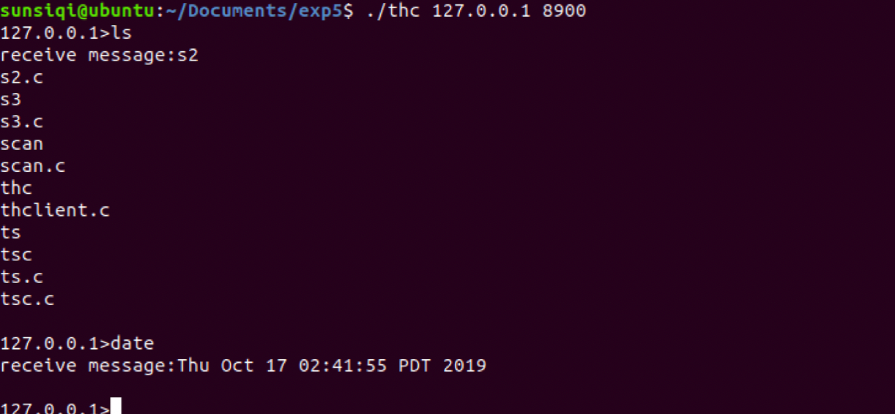
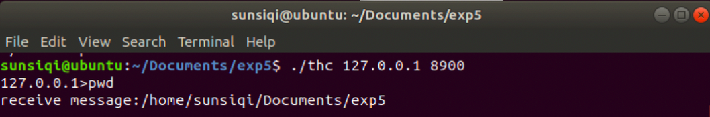
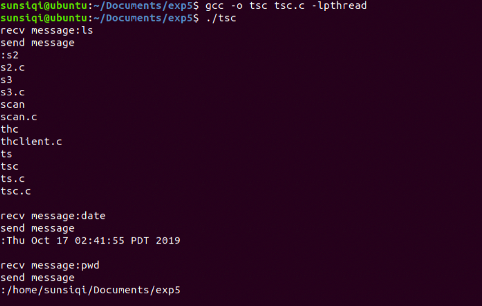
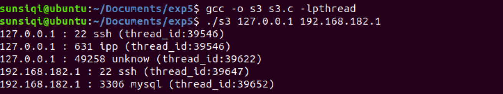

# Multithreading Programming

## Introduction
Threads are also called light processes, and creating a thread is much faster than creating a process. All threads in a process share the same global memory, which solves the problem of expensive fork functions and complicated inter-process communication.

## 1. Simple multithreading remote control program implementation
- The implementation process of a multithreading server is roughly similar to that of a multi-process. But because threads are shared memory, be careful not to close the listening socket inside the thread.
- Create, bind and listen to the socket, set up a loop to continuously receive client connections, call the accept function in the loop to establish a connection with the client, and if the connection is successfully established, create a thread and process the client request in the thread.
- Call the int pthread_create (pthread_t * tidp, const pthread_attr_t * attr, (void *) (* start_rtn) (void *), void * arg) function to create a thread; if the thread is created successfully, return 0 otherwise return an error number. The function parameters are a pointer to the thread identifier, thread attributes, the starting address of the thread running function, and the parameters of the running function.
- void * th_func (void * arg): The function accepts the return value of the accept function. The recv function is used to continuously receive client requests. When the client exits, the connection socket is closed. The function exits the thread.
- Start the server and start the first client

- Start the server and start the first client

- Server-side response

## 2. Simple multithreading port scanner program implementation
- The program can scan 5 IP addresses at the same time. Open one hundred threads for each IP address to scan it. If the port is open, use the function getservbyport to get its service name, and print on the screen: IP port servername, if it is an unknown service, the screen displays: ip port unkonown.
- Each thread uses the pthread_join (thread [i], NULL) function to block the execution of the current thread, and restarts the execution until the port that the thread should scan is scanned.
- Example: Run the program to scan two IP addresses.

